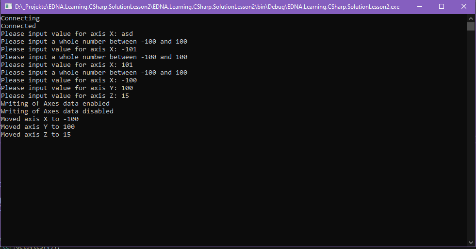

# Lesson 2

* Erstelle zunächst aus dieser Visual Studio Solution die Bibliothek EDNA.Learning.Csharp.dll.
* Erzeuge anschließend eine neue Konsolenanwendung und füge einen Verweis auf die erzeugte Bibliothek hinzu.
* In dieser Aufgabe soll ein Handshake mit der Steuerung durchgeführt werden. Ziel ist es, einen Datensatz an die Steuerung zu senden. Da wir nicht wissen, wann die Steuerung Daten verarbeitet, der Datensatz aber nur im Ganzen Gültigkeit hat, müssen wir eine Synchronisation mit der Steuerung durchführen, um zu verhindern, dass die Steuerung einen Teil der Daten verarbeitet, während ein anderer Teil der Daten noch nicht übertragen wurde.

## Anforderungen
* Erzeuge eine Instanz der Klasse EDNA.Learning.CSharp.Lesson1.Plc und übergib ihr eine Instanz von ConsoleLogger
* Stelle eine Verbindung zur Plc her
* Der Anwender soll in der Konsolenanwendung die Achspositionen für ein Dreiachsportal angeben können (X,Y,Z). Diese angegebenen Daten sollen anschließend an die Steuerung übertragen werden. Der Einfachheit halber, Sind die Achspositionen Ganzzahlen zwischen -100 und 100. Fehleingaben sollen abgefangen werden und der Benutzer zu einer erneuten Eingabe aufgefordert werden.
* Setze das Bit Area 6, Byte 4, Bit 0 auf 1 um eine Schreibanforderung an die Steuerung zu stellen
* Warte darauf, dass die Steuerung das Bit Area 5, Byte 4, Bit 0 auf 1 setzt, um zu signalisieren, dass die Daten geschrieben werden können.
* Schreibe die Achsdaten auf Area 6, Byte 5 bis Byte 10, als 16 Bit signed Integer (short), in der Reihenfolge X, Y, Z
* Setze anschließend das Bit zur Schreibanforderung auf 0 und warte, bis auch die Steuerung die Schreibfreigabe wieder auf 0 gesetzt hat
* Denk daran, die Verbindung zu trennen, bevor das Programm beendet wird

